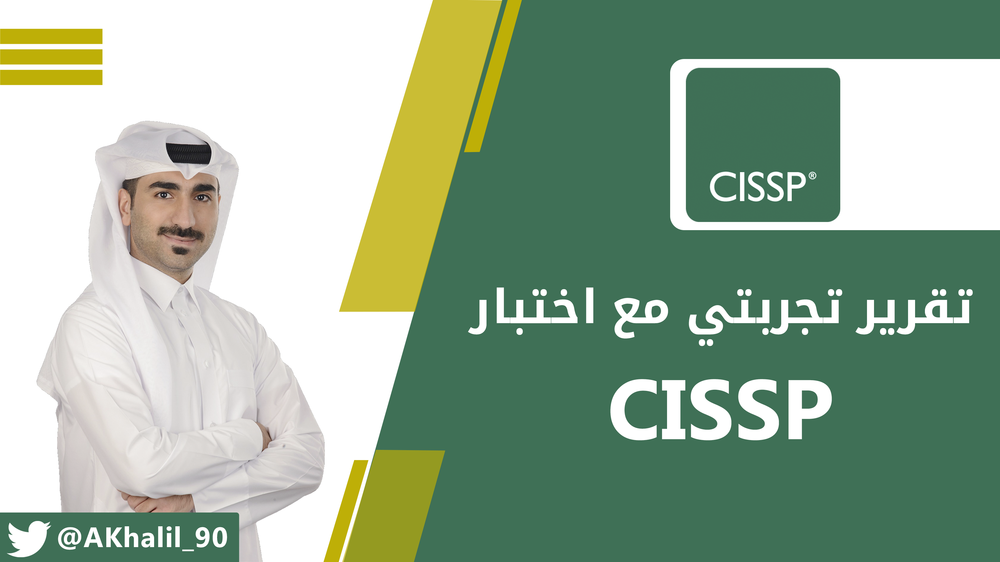
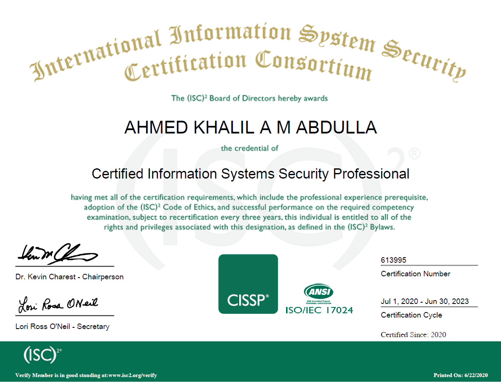

<h1 dir="rtl" align="right">تجربتي مع اختبار CISSP</h1>

<h2 dir="rtl" align="right">مقدمة</h2>

تعتبر شهادة محترف أمن نظم أمن المعلومات (Certified Information Systems Security Professonal) والمعروفة باختصار (<a href="https://www.isc2.org/Certifications/CISSP">CISSP</a>) من أسمى الشهادات الاحترافية في مجال الأمن السيبراني، والتي تركز على الناحيتين الإدارية والفنية، مع التركيز الأكبر على النواحي الإدارية في المجال، ولذلك تعتبر شهادة مهمة وضرورية لمن يعمل في الجانب الإداري في مجال أمن المعلومات مثل (CTO, CIO, CISO، وغيره من المناصب الإدارية).

تقدم الشهادة من منظمة (International Information System Security Certification Consortium) والمعروفة باختصار (<a href="https://www.isc2.org/">ISC2</a>)، وهي المنظمة التي تقدم مجموعة من الشهادات الاحترافية في مختلف المجالات مثل أمن المعلومات في الأنظمة السحابية وأنظمة التحكم الصناعية وغيرها.

<h2 dir="rtl" align="right">متطلبات الشهادة</h2>

قبل الخوص في تفاصيل ومحتوى الشهادة، فلهذه الشهادة متطلبات خبرة محددة يجب التأكد من توافرها لديك قبل التسجيل للاختبار، وهي كالتالي:

<strong>ما لا يقل عن (5) سنوات في وظيفة ترتبط بعدد (2) أو أكثر في مجالات شهادة </strong><strong>CISSP</strong><strong>. وفي حال كان لديك شهادة جامعية مدة الدراسة فيها (4) سنوات مثل البكالوريس، أو ما يعادلها، فسيتم تخفيض متطلب عدد السنوات الوظيفية المطلوبة إلى (4) سنوات فقط.</strong>

<h2 dir="rtl" align="right">المجالات (Domains) المغطاة ضمن شهادة CISSP</h2>

يضم منهج الشهادة عدد (8) مجالات رئيسية وهي كالتالي:

<ol dir='rtl'>
  <li>Security and Risk Management</li>
  <li>Asset Management</li>
  <li>Security Architecture and Engineering</li>
  <li>Communication and Network Security</li>
  <li>Identity and Access Management</li>
  <li>Security Assessment and Testing</li>
  <li>Security Operations</li>
  <li>Software Development Security</li>
</o>
<h2 dir="rtl" align="right">تفاصيل الاختبار</h2>

هذه التفاصيل ستقوم بالإجابة على استفسارات العديد من المهتمين في تقديم الاختبار:

<ul dir="rtl">
<li><strong>عدد الأسئلة: </strong>يتراوح عدد الأسئلة من (100) إلى (150) سؤال، حيث سيتم معالجة إجابتك على الأسئلة بشكل مستمر، فكلما كانت إجاباتك صحيحة، سيتم رفع مستوى صعوبة الأسئلة التالية، فإذا انتهى الاختبار بعد السؤال رقم (100) فهذا يعني بأن النظام استنتج بأنك ستجتاز الاختبار وسيتم انهاء الاختبار واعتبارك بأنك تخطيت الاختبار بنجاح. والعكس صحيح! فإن كانت إجاباتك خاطئة، فسيتم انهاء الاختبار بعد السؤال رقم (100) كذلك واعتبارك بأنك فشلت في تخطي الاختبار. بالإضافة إلى ذلك، إن لم يقم النظام بتحديد مستواك فعليا عند السؤال رقم (100)، فسيتمر الاختبار في تقديم الأسئلة إلى حد أقصى (150) سؤال، وقد ينتهي في أي وقت إن كان النظام قادر على تحديد مستواك قبل ذلك.</li>
<li><strong>مدة الاختبار: </strong>180 دقيقة (3 ساعات)</li>
<li><strong>درجة النجاح: </strong>700 نقطة من أصل 1000</li>
<li><strong>رسوم الاختبار: </strong>699 دولار أمريكي</li>
</ul>
<h2 dir="rtl" align="right">المراجع المستخدمة في التحضير للاختبار</h2>

هذه المراجع التي استخدمتها خلال فترة التحضير:

<ul dir="rtl">
<li><a href="https://www.comptia.org/certifications/security">مستند المحاور الرئيسية والفرعية (Exam Objectives)</a>: يمكن تحميل هذا المستند من الصفحة الرئيسية للشهادة (تأكد أنك تقوم باستخدام أحدث نسخة من المستند عند البدء بالتحضير للاختبار).</li>
<li><a href="https://www.youtube.com/playlist?list=PLG49S3nxzAnnVhoAaL4B6aMFDQ8_gdxAy">قناة Professor Messer</a>: قناة في اليوتيوب. من وجهة نظري بأن القناة جبارة بمعنى الكلمة للتجهيز لاختبارات +A و +Network و +Security. فيما يخص جزئية +Security، يمكنك الذهاب إلى هذا الرابط والذي يحتوي على مجموعة الفيديوهات الخاصة بالشهادة (إجمالي 13 ساعة)، مرتبة حسب ترتيب المحاور الفرعية والرئيسة بمستند (Exam Objectives) الرسمي.</li>
<li><a href="https://www.udemy.com/course/comptia-security-practice-exams/">كورس Json Dion في موقع Udemy</a>: هو ليس كورس بمعنى الكلمة، بل عدد (6) اختبارات تجريبية تحاكي بشكل كبير الاختبار الواقعي. تكلفة الكورس (11.99) باوند (جنية إسترليني).</li>
<li><a href="https://www.examcompass.com/comptia/security-plus-certification/free-security-plus-practice-tests">اختبارات قصيرة مجانية</a>: مجموعة أسئلة واختبارات قصيرة مجانية. لم أقم بالاعتماد عليها بشكل كبير خلال فترة تحضري، حيث أكتفيت بالاختبارات التي قمت بشرائها من Udemy.</li>
</ul>

هذه هي المراجع التي مررت عليها خلال فترة الاعداد، حيث لم اعتمد هذه المرة على أي من الكتب في عملية التحضير، على عكس عادتي.

سأقوم بذكر هذه المراجع وكيف استخدمتها في التحضير للاختبار.

<h2 dir="rtl" align="right">منهجية التحضير للاختبار:</h2>

بما أني قمت باجتياز اختبار CISSP مؤخرا (والذي اعتبره أصعب من اختبار +Security بمراحل عديدة)، فقد تمكنت من الاعداد لاختبار +Security في أربعة أيام فقط. نعم أربعة أيام فقط 😊. إليكم ما قمت به خلال الأربعة أيام:

<h3 dir="rtl" align="right">اليوم الأول (04/08/2020):</h3>
<ul dir="rtl">
<li>قمت بتحميل وطباعة مستند المحاور الرئيسية (Exam Objectives). يمكنك الحصول على نسخة المستند من الموقع الرسمي للاختبار.</li>
<li>بعد طباعة المستند، قمت بمراجعة عدد (3) محاور رئيسية (من أصل إجمالي 6 محاور رئيسية) بمحاورها الفرعية واستخدام قلم highlighter لتعليم كل ما لدي خبرة به. للمحاور التي لم أملك فيها المعرفة الكافية، أقوم بالرجوع لقناة Professor Messer ومشاهدة الفيديوهات المتعلقة بهذه المحاور.</li>
</ul>
<h3 dir="rtl" align="right">اليوم الثاني (05/08/2020):</h3>
<ul dir="rtl">
<li>قمت باستكمال مراجعة عدد (3) محاور رئيسة الأخرى في المستند، والرجوع إلى فيديوهات Professor Messer حسب الحاجة، كما تم في اليوم الأول.</li>
</ul>
<h3 dir="rtl" align="right">اليوم الثالث (06/08/2020):</h3>
<ul dir="rtl">
<li>بما أني قمت في اليوميين الأول والثاني بتغطية جميع محاور الاختبار، فقد قمت بالتسجيل للاختبار حيث أن أقرب موعد كان بتاريخ (08/08/2020)، مما يترك لي يومين للقيام بالاختبارات التجريبية.</li>
<li>أجريت عدد (3) اختبارات تجريبية التي قمت بشرائها من Udemy، وكانت هذه نتائجي:</li>
<ul dir="rtl">
<li>الاختبار الأول: 85%</li>
<li>الاختبار الثاني: 91%</li>
<li>الاختبار الثالث: 91%</li>
</ul>
</ul>
<h3 dir="rtl" align="right">اليوم الرابع (07/08/2020):</h3>
<ul dir="rtl">
<li>أجريت الاختبارات التجريبية المتبقية، وكانت النتائج كالتالي:</li>
<ul dir="rtl">
<li>الاختبار الرابع: 77%</li>
<li>الاختبار الخامس: 94%</li>
<li>الاختبار السادس: 87%</li>
</ul>
</ul>
<h3 dir="rtl" align="right">يوم الامتحان (09/08/2020) &ndash; يكرم المرء أو يهان:</h3>
<ul dir="rtl">
<li>اختباري كان في تمام الساعة 7:30 صباحا (أفضل الصباح الباكر لتقديم أي نوع من الاختبارات).</li>
<li>بفضل من الله، قمت باجتياز الاختبار وكانت الدرجة المحرزة (822) من أصل (950).</li>
<li>عدد الأسئلة في اختباري كانت (82) سؤال. وواجهت أسئلة في بداية الاختبار (عددها من 4-5 تقريبا) تسمى ب (performance-based questions) وكانت عبارة عن (drag-and-drop) وواحد عبارة عن تعريف لبعض الاعدادات المتعلقة بإعدادات حماية الشبكة اللاسلكية.</li>
</ul>
<h2 dir="rtl" align="right">نصائح متفرقة</h2>

هذه بعض النصائح المتفرقة التي قد تكون مفيدة للمقبلين على تقديم الاختبار:

<ul dir="rtl">
<li>استخدم أقلام highlighter مع مستند محاور الاختبار للتعليم على المحاور التي أتقنتها. سيساعدك ذلك على الاطلاع على نسبة انجازك بشكل سريع.</li>
<li>عند اكمالك لنسبة 50% من المحاور الرئيسية للاختبار، قم بحجز موعد الاختبار لضمان التزامك بتقديم الاختبار والحصول على الشهادة.</li>
<li>استخدم الاختبارات التجريبية التي قمت بذكرها أعلاه. إن حصلت على درجة أعلى من 80% في معظمها، فستنجح في الاختبار الفعلي بإذن الله.</li>
<li>توكل على الله وابدأ التجهيز للاختبار.</li>
</ul>
<h2 dir="rtl" align="right">مقتطفات</h2>
<table>
<tbody>
<tr>
<td>

</td>
<td>

</td>
</tr>
<tr>
<td dir="rtl">
استخدامي للـ highlighter على مستند المحاور الرئيسية الرسمي
</td>
<td dir="rtl">
صورة للشهادة :sunglasses:
</td>
</tr>
</tbody>
</table>
<h2 dir="rtl" align="right">التواصل</h2>

يمكنك التواصل معي على تويتر: <a href="https://www.twitter.com/AKhalil_90">@AKhalil_90</a>

